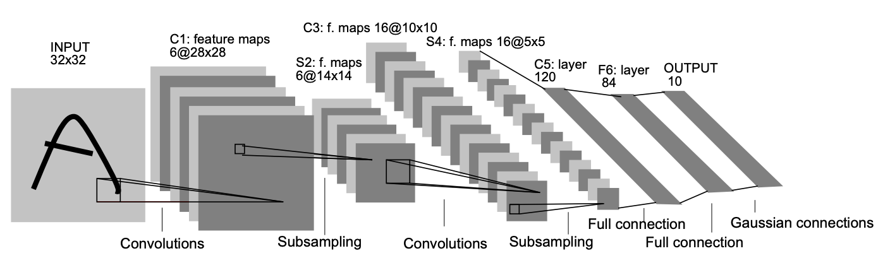
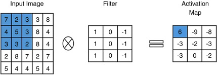
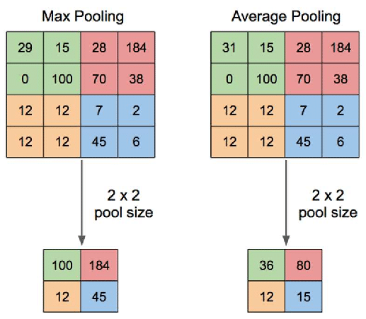

# CNN

MNIST 손글씨 숫자 분류를 위한 CNN(LeNet 구조)을 NumPy만으로 직접 구현한 프로젝트입니다. (딥러닝 프레임워크 없이 forward/backward propagation을 직접 작성)

원논문 : [Gradient-Based Learning Applied to Document Recognition](http://yann.lecun.com/exdb/publis/pdf/lecun-01a.pdf) - II. Convolutional Neural Networks For Isolated Caharacter Recognition

## 구현 내용

- Convolution layer forward/backward (for문 기반)
- Max Pooling layer forward/backward (for문 기반)
- im2col / col2im을 이용한 벡터화 conv/pooling
- for문 구현 vs im2col 구현 속도 비교
- LeNet 구조로 전체 순전파/역전파 파이프라인 구성 및 학습 루프

## 데이터셋

[01.mlp](../01.mlp)에서 사용한 MNIST 데이터셋을 동일하게 사용합니다. (`../01.mlp/dataset` 참조)

---

# 정리 노트

## 구조

## 순전파 (Forward Propagation)

### Convolution

작은 필터(커널)를 입력 위에서 `stride`만큼씩 이동시키며, 겹치는 영역(patch)과 커널을 원소별로 곱한 뒤 합산(내적)하는 연산. 필터 하나가 이미지 전체를 훑으면서 특정 패턴(edge, texture 등)이 있는 위치를 찾아내고, 그 결과가 feature map이 된다.

FC layer처럼 모든 입력-출력 쌍을 각각의 가중치로 연결하면 파라미터 수가 폭발하고 위치 정보도 무시된다. Convolution은 **동일한 필터를 전체 위치에 재사용(가중치 공유)**해서 파라미터 수를 줄이고, 국소 영역만 보는 **local connectivity**로 이미지의 지역적 패턴(공간 구조)을 보존한다.

$$
\begin{aligned}
H_{out} &= \left\lfloor \frac{H_{in} + 2 \cdot pad - kH}{stride} \right\rfloor + 1 \\
W_{out} &= \left\lfloor \frac{W_{in} + 2 \cdot pad - kW}{stride} \right\rfloor + 1
\end{aligned}
$$

### Max Pooling

feature map을 일정 구간(window)으로 나누고, 각 구간에서 가장 큰 값만 추출해 feature map의 크기를 줄이는 연산. Pooling을 통해 정보가 압축되어 다음 layer로 전달된다.

Pooling이 필요한 이유는 크게 두 가지다.
- **연산량/파라미터 감소**: feature map 크기를 줄여 뒤따르는 layer들의 연산량과 메모리 사용량을 낮춘다.
- **작은 위치 변화에 대한 강건함(translation invariance)**: 구간 내에서 최댓값의 위치가 한두 칸 이동해도 pooling 결과(최댓값 자체)는 잘 바뀌지 않으므로, 입력이 약간 이동/왜곡되어도 모델이 비슷하게 반응하게 해준다.

$$
\begin{aligned}
H_{out} &= \left\lfloor \frac{H_{in} - pool}{stride} \right\rfloor + 1 \\
W_{out} &= \left\lfloor \frac{W_{in} - pool}{stride} \right\rfloor + 1
\end{aligned}
$$

## 역전파 (Backpropagation)

### Convolution의 gradient
- `db`: dout 합 만큼을 db에 전파
- `dW`: patch * dout 만큼 돌면서 dW에 누적 전파
- `dX`: W[f] * dout 만큼을 겹치는 patch 위치에 += 로 누적 (같은 입력 영역이 여러 output 위치의 계산에 겹쳐서 쓰였으므로 gradient를 더해줘야 함)

### Max Pooling의 gradient
Forward 과정에서 각 pooling window에서 최댓값을 가진 입력만 출력값에 영향을 주었기 때문에, backward 과정에서는 forward에서 최댓값으로 선택되었던 위치에만 gradient를 전달하고 나머지 위치에는 0을 전달한다.

---

## im2col / col2im

### im2col이 빠른 이유

for문 기반 구현은 batch(N) × 필터 수(C_out) × 출력 위치(H_out × W_out) 만큼 Python 레벨 for loop를 돌며, 반복마다 작은 patch 하나와 필터 하나를 곱해 합산한다. 이때 실제 곱셈/덧셈량보다 **Python 인터프리터의 반복 오버헤드**(타입 체크, 객체 생성, 함수 호출 등)가 훨씬 크게 작용한다.

im2col은 이 반복을 없애는 대신
1. 겹치는 patch들을 전부 미리 꺼내 2차원 행렬 `col` (patch 개수 × patch 크기)로 펼치고
2. 필터도 2차원 행렬 `W_col` (patch 크기 × 필터 개수)로 펼친 뒤
3. `col @ W_col` **행렬곱 한 번**으로 모든 patch-필터 조합의 내적을 동시에 계산한다.

행렬곱은 NumPy 내부적으로 BLAS(OpenBLAS, MKL 등)의 고도로 최적화된 C/Fortran 루틴을 호출하는데, 이 루틴은
- **SIMD 벡터 명령어**로 한 번에 여러 원소를 동시에 곱셈/합산
- **캐시 친화적인 blocking/tiling**으로 메모리 접근 최소화
- **멀티스레딩**으로 여러 코어에 연산 분산

을 활용한다. 즉 같은 연산량이라도 Python for문은 인터프리터 오버헤드 때문에 순수 연산 시간보다 훨씬 오래 걸리고, 행렬곱은 그 오버헤드 없이 하드웨어 성능에 가깝게 도달한다.

**트레이드오프**: patch들이 겹치는 영역을 그대로 복사해서 저장하므로(`col`의 크기 ≈ 원본 대비 `kH*kW`배), 커널이 클수록·stride가 작을수록(겹침이 많을수록) 메모리 사용량이 크게 늘어난다. 즉 im2col은 **메모리를 더 써서 연산을 벡터화**하는 방식.

## 속도 비교

### for문 vs im2col

`compare_conv_speed`로 실측한 값을 기록. 일반적인 경향:
- 배치 크기 N, 채널 수, 출력 크기(H_out × W_out)가 클수록 for문의 반복 횟수가 늘어나 im2col과의 격차가 커진다 (보통 수십~수백 배 차이).
- 반대로 아주 작은 입력에서는 `col`을 만드는 reshape/transpose 자체의 상대적 비중이 커져 speedup이 작게 나올 수 있다.

측정값:
- (여기에 `compare_conv_speed` 실행 결과 기록)

### NumPy vs PyTorch (CPU)

im2col + 행렬곱으로 NumPy도 BLAS를 쓰지만, PyTorch(`nn.Conv2d`)는 CPU에서도 보통 더 빠르다.
- PyTorch는 딥러닝 전용으로 최적화된 라이브러리(oneDNN 등)를 사용해, 상황에 따라 im2col+GEMM이 아니라 direct convolution이나 **Winograd 알고리즘**(예: 3x3 커널에서 곱셈 횟수 자체를 줄임) 등 더 효율적인 방식을 자동 선택한다.
- forward뿐 아니라 backward(autograd)까지 C++로 구현되어 있어, 우리 구현처럼 Python에서 cache를 주고받는 오버헤드가 없다.
- 연산 그래프 레벨에서 멀티스레드 병렬화, 메모리 재사용, 커널 퓨전(fusion) 등을 적용한다.

즉 NumPy im2col이 "for문을 없앤 것"이라면, PyTorch는 "convolution에 특화된 알고리즘 선택 + 저수준 최적화"까지 더한 것.

### CPU vs GPU

GPU가 conv 연산에 유리한 근본 이유는 하드웨어 구조 차이다.
- **CPU**: 소수(수십 개 이하)의 강력한 코어. 복잡한 분기 예측·큰 캐시 계층에 최적화되어 순차적이거나 분기가 많은 작업에 강하다.
- **GPU**: 수천 개의 단순한 코어(SIMT: Single Instruction, Multiple Threads)로, 동일한 연산을 대량의 데이터에 동시에 적용하는 데 특화되어 있다.

Convolution은 출력의 각 patch가 서로 독립적으로 계산 가능한 **embarrassingly parallel** 연산이라 GPU의 병렬 구조와 정확히 맞아떨어진다. 추가로
- GPU는 HBM 등 CPU 대비 훨씬 높은 메모리 대역폭을 가져 대량의 데이터를 빠르게 읽고 쓸 수 있다.
- cuDNN 같은 라이브러리는 Winograd, FFT 기반 convolution 등 곱셈 횟수 자체를 줄이는 알고리즘까지 GPU에 맞게 구현해둔다.
- 최신 GPU는 **Tensor Core**처럼 행렬곱(특히 FP16/TF32 등 저정밀도)을 전용 하드웨어로 가속하는 유닛을 갖고 있어 GEMM 연산 자체가 훨씬 빠르다.

결과적으로 대규모 conv 연산에서 GPU는 CPU 대비 수십~수백 배 빠른 경우가 흔하지만, 정확한 배수는 모델/배치 크기와 하드웨어에 따라 크게 달라지므로 실측이 필요하다.